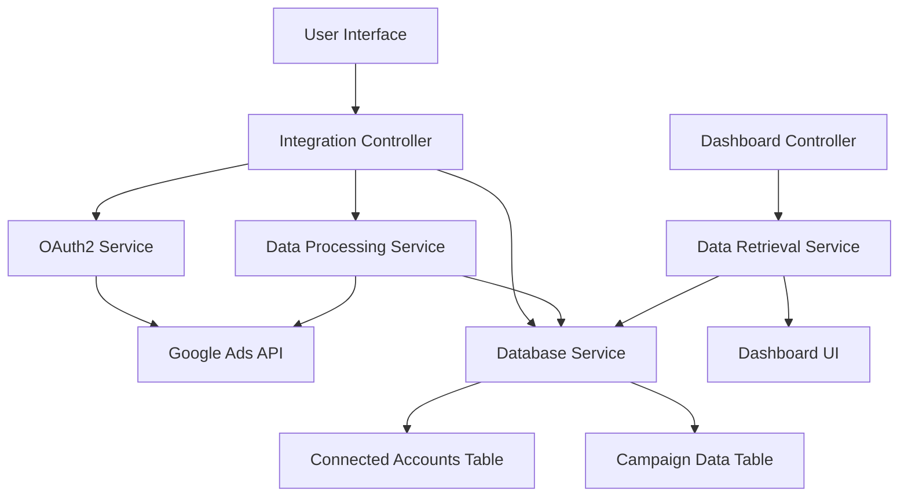

# Ad Platform Integration Plan

## Overview
This document outlines the implementation plan for integrating ad platforms (starting with Google Ads as MVP) into the Ad Reporting Tool. The integration will allow users to connect their advertising accounts and view performance metrics in a unified dashboard.

## Architecture Diagram



## Database Schema

### Connected Accounts Table
- id (primary key)
- user_id (foreign key to users table)
- platform (enum: google_ads, meta_ads, tiktok_ads)
- account_id (platform-specific account identifier)
- refresh_token (encrypted)
- access_token (encrypted)
- expires_at (timestamp)
- is_active (boolean)
- created_at (timestamp)
- updated_at (timestamp)

### Campaign Data Table
- id (primary key)
- account_id (foreign key to connected_accounts)
- campaign_id (platform-specific campaign identifier)
- campaign_name
- date (date of metrics)
- spend (decimal)
- impressions (integer)
- clicks (integer)
- conversions (integer)
- created_at (timestamp)
- updated_at (timestamp)

## Database Migration Code

### Connected Accounts Table Migration
```typescript
import { BaseSchema } from '@adonisjs/lucid/schema'

export default class extends BaseSchema {
  protected tableName = 'connected_accounts'

  async up() {
    this.schema.createTable(this.tableName, (table) => {
      table.increments('id')
      table.integer('user_id').unsigned().references('id').inTable('users').onDelete('CASCADE')
      table.enu('platform', ['google_ads', 'meta_ads', 'tiktok_ads']).notNullable()
      table.string('account_id').notNullable()
      table.text('refresh_token')
      table.text('access_token')
      table.timestamp('expires_at').nullable()
      table.boolean('is_active').defaultTo(true)
      table.timestamp('created_at').notNullable()
      table.timestamp('updated_at').nullable()
    })
  }

  async down() {
    this.schema.dropTable(this.tableName)
  }
}
```

### Campaign Data Table Migration
```typescript
import { BaseSchema } from '@adonisjs/lucid/schema'

export default class extends BaseSchema {
  protected tableName = 'campaign_data'

  async up() {
    this.schema.createTable(this.tableName, (table) => {
      table.increments('id')
      table.integer('account_id').unsigned().references('id').inTable('connected_accounts').onDelete('CASCADE')
      table.string('campaign_id').notNullable()
      table.string('campaign_name').notNullable()
      table.date('date').notNullable()
      table.decimal('spend', 12, 2).defaultTo(0)
      table.integer('impressions').defaultTo(0)
      table.integer('clicks').defaultTo(0)
      table.integer('conversions').defaultTo(0)
      table.timestamp('created_at').notNullable()
      table.timestamp('updated_at').nullable()
    })
  }

  async down() {
    this.schema.dropTable(this.tableName)
  }
}
```

## Model Definitions

### ConnectedAccount Model
```typescript
import { DateTime } from 'luxon'
import { BaseModel, column, belongsTo, BelongsTo } from '@adonisjs/lucid/orm'
import User from '#models/user'

export default class ConnectedAccount extends BaseModel {
  @column({ isPrimary: true })
  declare id: number

  @column()
  declare userId: number

  @column()
  declare platform: 'google_ads' | 'meta_ads' | 'tiktok_ads'

  @column()
  declare accountId: string

  @column()
  declare refreshToken: string | null

  @column()
  declare accessToken: string | null

  @column()
  declare expiresAt: DateTime | null

  @column()
  declare isActive: boolean

  @column.dateTime({ autoCreate: true })
  declare createdAt: DateTime

  @column.dateTime({ autoCreate: true, autoUpdate: true })
  declare updatedAt: DateTime | null

  @belongsTo(() => User)
  declare user: BelongsTo<typeof User>
}
```

### CampaignData Model
```typescript
import { DateTime } from 'luxon'
import { BaseModel, column, belongsTo, BelongsTo } from '@adonisjs/lucid/orm'
import ConnectedAccount from '#models/connected_account'

export default class CampaignData extends BaseModel {
  @column({ isPrimary: true })
  declare id: number

  @column()
  declare accountId: number

  @column()
  declare campaignId: string

  @column()
  declare campaignName: string

  @column.date()
  declare date: DateTime

  @column()
  declare spend: number

  @column()
  declare impressions: number

  @column()
  declare clicks: number

  @column()
  declare conversions: number

  @column.dateTime({ autoCreate: true })
  declare createdAt: DateTime

  @column.dateTime({ autoCreate: true, autoUpdate: true })
  declare updatedAt: DateTime | null

  @belongsTo(() => ConnectedAccount)
  declare connectedAccount: BelongsTo<typeof ConnectedAccount>
}
```

## Controller Structure

### IntegrationsController
```typescript
import type { HttpContext } from '@adonisjs/core/http'
import ConnectedAccount from '#models/connected_account'

export default class IntegrationsController {
  /**
   * Show integration management page
   */
  async index({ view, auth }: HttpContext) {
    const user = auth.getUserOrFail()
    const connectedAccounts = await ConnectedAccount.query()
      .where('user_id', user.id)
      .orderBy('created_at', 'desc')

    return view.render('pages/integrations/index', {
      user,
      connectedAccounts,
    })
  }

  /**
   * Initiate Google Ads connection
   */
  async connectGoogleAds({ response }: HttpContext) {
    // Implementation for OAuth2 flow initiation
  }

  /**
   * Handle Google Ads OAuth2 callback
   */
  async googleAdsCallback({ request, response, session }: HttpContext) {
    // Implementation for handling OAuth2 callback
  }

  /**
   * Disconnect an ad platform account
   */
  async disconnect({ params, auth, response, session }: HttpContext) {
    const user = auth.getUserOrFail()
    const account = await ConnectedAccount.query()
      .where('id', params.id)
      .where('user_id', user.id)
      .firstOrFail()

    await account.delete()
    session.flash('success', 'Account disconnected successfully')
    return response.redirect().back()
  }

  /**
   * Manually sync data from connected accounts
   */
  async syncData({ params, auth, response, session }: HttpContext) {
    const user = auth.getUserOrFail()
    const account = await ConnectedAccount.query()
      .where('id', params.id)
      .where('user_id', user.id)
      .firstOrFail()

    // Implementation for data synchronization
    session.flash('success', 'Data sync initiated successfully')
    return response.redirect().back()
  }
}
```

## OAuth2 Flow Implementation (Google Ads)

### Configuration
First, we need to register the application with Google Ads API and configure the OAuth2 settings:

```typescript
// config/google_ads.ts
import env from '#start/env'

export default {
  clientId: env.get('GOOGLE_ADS_CLIENT_ID'),
  clientSecret: env.get('GOOGLE_ADS_CLIENT_SECRET'),
  redirectUri: env.get('GOOGLE_ADS_REDIRECT_URI'),
  scopes: [
    'https://www.googleapis.com/auth/adwords',
    'https://www.googleapis.com/auth/userinfo.email'
  ],
  apiVersion: 'v16',
}
```

### OAuth2 Service
```typescript
// app/services/google_ads_oauth_service.ts
import { google } from 'googleapis'
import { randomBytes } from 'crypto'
import env from '#start/env'
import ConnectedAccount from '#models/connected_account'

export default class GoogleAdsOAuthService {
  private oauth2Client

  constructor() {
    this.oauth2Client = new google.auth.OAuth2(
      env.get('GOOGLE_ADS_CLIENT_ID'),
      env.get('GOOGLE_ADS_CLIENT_SECRET'),
      env.get('GOOGLE_ADS_REDIRECT_URI')
    )
  }

  /**
   * Generate authorization URL for Google Ads OAuth2 flow
   */
  generateAuthUrl(userId: number): string {
    const state = `${userId}-${randomBytes(32).toString('hex')}`
    
    return this.oauth2Client.generateAuthUrl({
      access_type: 'offline',
      scope: [
        'https://www.googleapis.com/auth/adwords',
        'https://www.googleapis.com/auth/userinfo.email'
      ],
      state: state,
      prompt: 'consent'
    })
  }

  /**
   * Handle OAuth2 callback and store tokens
   */
  async handleCallback(code: string, state: string): Promise<ConnectedAccount> {
    // Verify state parameter to prevent CSRF
    const [userId] = state.split('-')
    
    const { tokens } = await this.oauth2Client.getToken(code)
    this.oauth2Client.setCredentials(tokens)
    
    // Get user info to identify the Google Ads account
    const oauth2 = google.oauth2({ version: 'v2', auth: this.oauth2Client })
    const userInfo = await oauth2.userinfo.get()
    
    // Store connected account in database
    const connectedAccount = await ConnectedAccount.create({
      userId: parseInt(userId),
      platform: 'google_ads',
      accountId: userInfo.data.email || '',
      refreshToken: tokens.refresh_token,
      accessToken: tokens.access_token,
      expiresAt: tokens.expiry_date ? new Date(tokens.expiry_date) : null,
      isActive: true
    })
    
    return connectedAccount
  }

  /**
   * Refresh access token using refresh token
   */
  async refreshAccessToken(connectedAccount: ConnectedAccount): Promise<void> {
    if (!connectedAccount.refreshToken) {
      throw new Error('No refresh token available')
    }

    this.oauth2Client.setCredentials({
      refresh_token: connectedAccount.refreshToken
    })

    const { credentials } = await this.oauth2Client.refreshAccessToken()
    
    connectedAccount.accessToken = credentials.access_token
    connectedAccount.expiresAt = credentials.expiry_date ? new Date(credentials.expiry_date) : null
    await connectedAccount.save()
  }
}
```

## Routes Implementation

### Integration Routes
```typescript
// start/routes/integrations.ts
import router from '@adonisjs/core/services/router'
const { middleware } = await import('#start/kernel')

const IntegrationsController = () => import('#controllers/integrations/integrations_controller')

// Protected integration routes
router
  .group(() => {
    // Integration management
    router.get('/', [IntegrationsController, 'index']).as('integrations.index')
    
    // Google Ads integration
    router.get('/google-ads/connect', [IntegrationsController, 'connectGoogleAds']).as('integrations.google_ads.connect')
    router.get('/google-ads/callback', [IntegrationsController, 'googleAdsCallback']).as('integrations.google_ads.callback')
    
    // Account management
    router.delete('/:id/disconnect', [IntegrationsController, 'disconnect']).as('integrations.disconnect')
    router.post('/:id/sync', [IntegrationsController, 'syncData']).as('integrations.sync')
  })
  .prefix('/integrations')
  .middleware([middleware.auth()])
```

### Updated Main Routes File
```typescript
// start/routes.ts
import router from '@adonisjs/core/services/router'

// Import route modules
import './routes/auth.js'
import './routes/dashboard.js'
import './routes/integrations.js'  // Add this line

// Test route to verify Edge is working
router.get('/edge-test', async ({ view }) => {
  return view.render('test')
})

// Home route - redirects based on auth status
router.get('/', async ({ auth, response }) => {
  if (await auth.check()) {
    return response.redirect().toRoute('dashboard.index')
  }
  return response.redirect().toRoute('auth.login')
})
```

## Dashboard Updates

### Updated Dashboard Controller
```typescript
// app/controllers/dashboard/dashboard_controller.ts
import type { HttpContext } from '@adonisjs/core/http'
import ConnectedAccount from '#models/connected_account'
import CampaignData from '#models/campaign_data'

export default class DashboardController {
  /**
   * Display dashboard index page
   */
  async index({ view, auth }: HttpContext) {
    const user = auth.getUserOrFail()
    
    // Get connected accounts
    const connectedAccounts = await ConnectedAccount.query()
      .where('user_id', user.id)
      .orderBy('created_at', 'desc')
    
    // Get campaign performance data
    const campaignData = await CampaignData.query()
      .whereHas('connectedAccount', (query) => {
        query.where('user_id', user.id)
      })
      .orderBy('date', 'desc')
      .limit(10)
    
    // Calculate stats
    let totalSpend = 0
    let totalImpressions = 0
    let totalClicks = 0
    let totalConversions = 0
    
    campaignData.forEach(data => {
      totalSpend += data.spend
      totalImpressions += data.impressions
      totalClicks += data.clicks
      totalConversions += data.conversions
    })

    return view.render('pages/dashboard/index', {
      user,
      connectedAccounts,
      campaignData,
      stats: {
        totalSpend: totalSpend.toFixed(2),
        totalImpressions,
        totalClicks,
        totalConversions,
      },
    })
  }

  /**
   * Display dashboard overview
   */
  async overview({ view, auth }: HttpContext) {
    const user = auth.getUserOrFail()
    
    // Get connected accounts
    const connectedAccounts = await ConnectedAccount.query()
      .where('user_id', user.id)
      .orderBy('created_at', 'desc')
    
    // Get campaign performance data for charts
    const campaignData = await CampaignData.query()
      .whereHas('connectedAccount', (query) => {
        query.where('user_id', user.id)
      })
      .orderBy('date', 'desc')
      .limit(30)

    return view.render('pages/dashboard/overview', {
      user,
      connectedAccounts,
      campaignData,
    })
  }
}
```

### Updated Dashboard Views
The dashboard views will need to be updated to display:
1. Connected accounts section showing which platforms are connected
2. Campaign performance data in tables and charts
3. Integration management buttons

## Data Fetching and Storage Logic (Google Ads)

### Google Ads Service
```typescript
// app/services/google_ads_service.ts
import { google } from 'googleapis'
import env from '#start/env'
import ConnectedAccount from '#models/connected_account'
import CampaignData from '#models/campaign_data'
import GoogleAdsOAuthService from '#services/google_ads_oauth_service'
import logger from '@adonisjs/core/services/logger'

export default class GoogleAdsService {
  private oauthService: GoogleAdsOAuthService

  constructor() {
    this.oauthService = new GoogleAdsOAuthService()
  }

  /**
   * Fetch campaign performance data from Google Ads API
   */
  async fetchCampaignData(connectedAccount: ConnectedAccount): Promise<void> {
    try {
      // Refresh access token if needed
      if (this.isTokenExpired(connectedAccount)) {
        await this.oauthService.refreshAccessToken(connectedAccount)
      }

      // Set up Google Ads API client
      const auth = new google.auth.OAuth2(
        env.get('GOOGLE_ADS_CLIENT_ID'),
        env.get('GOOGLE_ADS_CLIENT_SECRET'),
        env.get('GOOGLE_ADS_REDIRECT_URI')
      )
      
      auth.setCredentials({
        access_token: connectedAccount.accessToken
      })

      const ads = google.ads({
        version: 'v16',
        auth: auth
      })

      // Fetch campaign data for the last 30 days
      const endDate = new Date()
      const startDate = new Date()
      startDate.setDate(startDate.getDate() - 30)

      const query = `
        SELECT 
          campaign.id,
          campaign.name,
          metrics.impressions,
          metrics.clicks,
          metrics.cost_micros,
          metrics.conversions,
          segments.date
        FROM campaign
        WHERE segments.date BETWEEN '${startDate.toISOString().split('T')[0]}' AND '${endDate.toISOString().split('T')[0]}'
        ORDER BY segments.date DESC
      `

      // Execute the query
      const response = await ads.customers.search({
        customerId: connectedAccount.accountId,
        query: query
      })

      // Process and store the data
      if (response.data.results) {
        for (const row of response.data.results) {
          const campaignId = row.campaign.id
          const campaignName = row.campaign.name
          const date = row.segments.date
          const impressions = row.metrics.impressions || 0
          const clicks = row.metrics.clicks || 0
          const costMicros = row.metrics.cost_micros || 0
          const conversions = row.metrics.conversions || 0

          // Convert cost from micros to standard currency
          const spend = costMicros / 1000000

          // Check if we already have this data
          const existingData = await CampaignData.query()
            .where('account_id', connectedAccount.id)
            .where('campaign_id', campaignId)
            .where('date', date)
            .first()

          if (existingData) {
            // Update existing record
            existingData.campaignName = campaignName
            existingData.impressions = impressions
            existingData.clicks = clicks
            existingData.spend = spend
            existingData.conversions = conversions
            await existingData.save()
          } else {
            // Create new record
            await CampaignData.create({
              accountId: connectedAccount.id,
              campaignId: campaignId,
              campaignName: campaignName,
              date: date,
              impressions: impressions,
              clicks: clicks,
              spend: spend,
              conversions: conversions
            })
          }
        }
      }
    } catch (error) {
      logger.error('Error fetching Google Ads data:', error)
      throw new Error(`Failed to fetch Google Ads data: ${error.message}`)
    }
  }

  /**
   * Check if access token is expired
   */
  private isTokenExpired(connectedAccount: ConnectedAccount): boolean {
    if (!connectedAccount.expiresAt) {
      return true
    }
    
    // Add 5 minute buffer to account for clock differences
    const bufferTime = 5 * 60 * 1000
    return Date.now() >= (connectedAccount.expiresAt.toMillis() - bufferTime)
  }

  /**
   * Get available Google Ads accounts for the connected user
   */
  async getAvailableAccounts(connectedAccount: ConnectedAccount): Promise<any[]> {
    try {
      // Refresh access token if needed
      if (this.isTokenExpired(connectedAccount)) {
        await this.oauthService.refreshAccessToken(connectedAccount)
      }

      // Set up Google Ads API client
      const auth = new google.auth.OAuth2(
        env.get('GOOGLE_ADS_CLIENT_ID'),
        env.get('GOOGLE_ADS_CLIENT_SECRET'),
        env.get('GOOGLE_ADS_REDIRECT_URI')
      )
      
      auth.setCredentials({
        access_token: connectedAccount.accessToken
      })

      const ads = google.ads({
        version: 'v16',
        auth: auth
      })

      // Fetch available accounts
      const response = await ads.customers.listAccessibleCustomers({
        auth: auth
      })

      return response.data.resourceNames || []
    } catch (error) {
      logger.error('Error fetching Google Ads accounts:', error)
      throw new Error(`Failed to fetch Google Ads accounts: ${error.message}`)
    }
  }
}
```

### Updated Integrations Controller with Data Sync
```typescript
// app/controllers/integrations/integrations_controller.ts
import type { HttpContext } from '@adonisjs/core/http'
import ConnectedAccount from '#models/connected_account'
import GoogleAdsService from '#services/google_ads_service'
import GoogleAdsOAuthService from '#services/google_ads_oauth_service'

export default class IntegrationsController {
  private googleAdsService: GoogleAdsService
  private googleAdsOAuthService: GoogleAdsOAuthService

  constructor() {
    this.googleAdsService = new GoogleAdsService()
    this.googleAdsOAuthService = new GoogleAdsOAuthService()
  }

  /**
   * Show integration management page
   */
  async index({ view, auth }: HttpContext) {
    const user = auth.getUserOrFail()
    const connectedAccounts = await ConnectedAccount.query()
      .where('user_id', user.id)
      .orderBy('created_at', 'desc')

    return view.render('pages/integrations/index', {
      user,
      connectedAccounts,
    })
  }

  /**
   * Initiate Google Ads connection
   */
  async connectGoogleAds({ auth, response }: HttpContext) {
    const user = auth.getUserOrFail()
    const authUrl = this.googleAdsOAuthService.generateAuthUrl(user.id)
    return response.redirect().toUrl(authUrl)
  }

  /**
   * Handle Google Ads OAuth2 callback
   */
  async googleAdsCallback({ request, response, session }: HttpContext) {
    try {
      const code = request.qs().code
      const state = request.qs().state

      if (!code || !state) {
        session.flash('error', 'Invalid OAuth2 callback')
        return response.redirect().toRoute('integrations.index')
      }

      await this.googleAdsOAuthService.handleCallback(code, state)
      session.flash('success', 'Google Ads account connected successfully')
      return response.redirect().toRoute('integrations.index')
    } catch (error) {
      session.flash('error', 'Failed to connect Google Ads account')
      return response.redirect().toRoute('integrations.index')
    }
  }

  /**
   * Disconnect an ad platform account
   */
  async disconnect({ params, auth, response, session }: HttpContext) {
    try {
      const user = auth.getUserOrFail()
      const account = await ConnectedAccount.query()
        .where('id', params.id)
        .where('user_id', user.id)
        .firstOrFail()

      await account.delete()
      session.flash('success', 'Account disconnected successfully')
      return response.redirect().toRoute('integrations.index')
    } catch (error) {
      session.flash('error', 'Failed to disconnect account')
      return response.redirect().toRoute('integrations.index')
    }
  }

  /**
   * Manually sync data from connected accounts
   */
  async syncData({ params, auth, response, session }: HttpContext) {
    try {
      const user = auth.getUserOrFail()
      const account = await ConnectedAccount.query()
        .where('id', params.id)
        .where('user_id', user.id)
        .where('platform', 'google_ads')
        .firstOrFail()

      await this.googleAdsService.fetchCampaignData(account)
      session.flash('success', 'Data synced successfully')
      return response.redirect().toRoute('integrations.index')
    } catch (error) {
      session.flash('error', `Failed to sync data: ${error.message}`)
      return response.redirect().toRoute('integrations.index')
    }
  }
}
```

## UI Components for Integration Management

### Integration Management Page
```edge
<!-- resources/views/pages/integrations/index.edge -->
@layout('layouts/app')
  @set('title', 'Integration Management')

    @section('content')
      <div class="mb-8">
        <div class="flex flex-col sm:flex-row sm:items-center sm:justify-between">
          <div>
            <h1 class="text-3xl font-bold text-gray-900 mb-2">
              <i class="fas fa-plug mr-2 text-blue-600"></i>
              Integration Management
            </h1>
            <p class="text-gray-600">
              Connect your advertising platforms to start tracking performance
            </p>
          </div>
        </div>
      </div>

      <!-- Connected Accounts -->
      <div class="bg-white rounded-xl shadow-lg mb-8">
        <div class="px-6 py-4 border-b border-gray-200">
          <h2 class="text-xl font-bold text-gray-900">
            <i class="fas fa-link mr-2 text-green-600"></i>
            Connected Accounts
          </h2>
        </div>
        <div class="p-6">
          @if(connectedAccounts.length > 0)
            <div class="space-y-4">
              @each(account in connectedAccounts)
                <div class="flex items-center justify-between p-4 border border-gray-200 rounded-lg">
                  <div class="flex items-center">
                    @if(account.platform === 'google_ads')
                      <div class="w-10 h-10 bg-blue-100 rounded-lg flex items-center justify-center">
                        <i class="fab fa-google text-blue-600"></i>
                      </div>
                    @endif
                    <div class="ml-4">
                      <h3 class="text-sm font-medium text-gray-900">
                        {{ account.platform.toUpperCase() }}
                      </h3>
                      <p class="text-xs text-gray-500">
                        Connected on {{ account.createdAt.toFormat('MMM dd, yyyy') }}
                      </p>
                    </div>
                  </div>
                  <div class="flex items-center space-x-2">
                    <form method="POST" action="{{ route('integrations.sync', { id: account.id }) }}">
                      {{ csrfField() }}
                      <button type="submit" class="px-3 py-1 text-xs font-medium text-blue-600 border border-blue-600 rounded-md hover:bg-blue-50">
                        Sync Data
                      </button>
                    </form>
                    <form method="POST" action="{{ route('integrations.disconnect', { id: account.id }) }}">
                      {{ csrfField() }}
                      <input type="hidden" name="_method" value="DELETE">
                      <button type="submit" class="px-3 py-1 text-xs font-medium text-red-600 border border-red-600 rounded-md hover:bg-red-50">
                        Disconnect
                      </button>
                    </form>
                  </div>
                </div>
              @end
            </div>
          @else
            <div class="text-center py-8">
              <i class="fas fa-unlink text-4xl text-gray-300 mb-4"></i>
              <h3 class="text-lg font-semibold text-gray-700 mb-2">
                No Connected Accounts
              </h3>
              <p class="text-gray-500 mb-4">
                Connect your advertising platforms to start tracking performance
              </p>
            </div>
          @endif
        </div>
      </div>

      <!-- Available Integrations -->
      <div class="bg-white rounded-xl shadow-lg">
        <div class="px-6 py-4 border-b border-gray-200">
          <h2 class="text-xl font-bold text-gray-900">
            <i class="fas fa-plus-circle mr-2 text-blue-600"></i>
            Available Integrations
          </h2>
        </div>
        <div class="p-6">
          <div class="grid grid-cols-1 md:grid-cols-3 gap-6">
            <!-- Google Ads -->
            <div class="border border-gray-200 rounded-lg p-6 hover:shadow-md transition-shadow">
              <div class="w-12 h-12 bg-blue-100 rounded-lg flex items-center justify-center mb-4">
                <i class="fab fa-google text-blue-600 text-xl"></i>
              </div>
              <h3 class="text-lg font-semibold text-gray-900 mb-2">Google Ads</h3>
              <p class="text-gray-600 text-sm mb-4">
                Connect your Google Ads account to track campaign performance
              </p>
              <a href="{{ route('integrations.google_ads.connect') }}" class="inline-flex items-center px-4 py-2 bg-blue-600 text-white text-sm font-medium rounded-md hover:bg-blue-700">
                Connect Account
                <i class="fas fa-arrow-right ml-2 text-xs"></i>
              </a>
            </div>

            <!-- Meta Ads (Placeholder) -->
            <div class="border border-gray-200 rounded-lg p-6 opacity-50">
              <div class="w-12 h-12 bg-blue-100 rounded-lg flex items-center justify-center mb-4">
                <i class="fab fa-facebook text-blue-600 text-xl"></i>
              </div>
              <h3 class="text-lg font-semibold text-gray-900 mb-2">Meta Ads</h3>
              <p class="text-gray-600 text-sm mb-4">
                Connect Facebook & Instagram ads (Coming Soon)
              </p>
              <button disabled class="inline-flex items-center px-4 py-2 bg-gray-300 text-gray-500 text-sm font-medium rounded-md cursor-not-allowed">
                Connect Account
              </button>
            </div>

            <!-- TikTok Ads (Placeholder) -->
            <div class="border border-gray-200 rounded-lg p-6 opacity-50">
              <div class="w-12 h-12 bg-black rounded-lg flex items-center justify-center mb-4">
                <i class="fab fa-tiktok text-white text-xl"></i>
              </div>
              <h3 class="text-lg font-semibold text-gray-900 mb-2">TikTok Ads</h3>
              <p class="text-gray-600 text-sm mb-4">
                Connect your TikTok for Business (Coming Soon)
              </p>
              <button disabled class="inline-flex items-center px-4 py-2 bg-gray-300 text-gray-500 text-sm font-medium rounded-md cursor-not-allowed">
                Connect Account
              </button>
            </div>
          </div>
        </div>
      </div>
    @end
```

### Updated Dashboard UI Components
```edge
<!-- resources/views/pages/dashboard/index.edge (Updated Sections) -->
<!-- Connected Accounts Section -->
<div class="bg-white rounded-lg shadow-sm border border-gray-200 mb-8">
  <div class="p-6">
    <h2 class="text-lg font-semibold text-gray-900 mb-4">
      <i class="fas fa-link mr-2 text-green-600"></i>
      Connected Accounts
    </h2>
    @if(connectedAccounts.length > 0)
      <div class="space-y-3">
        @each(account in connectedAccounts)
          <div class="flex items-center p-3 bg-green-50 rounded-lg border-l-4 border-green-500">
            <div class="flex-shrink-0">
              @if(account.platform === 'google_ads')
                <div class="w-6 h-6 bg-green-500 rounded-full flex items-center justify-center">
                  <i class="fab fa-google text-white text-xs"></i>
                </div>
              @endif
            </div>
            <div class="ml-3">
              <span class="text-sm font-medium text-green-900">{{ account.platform.toUpperCase() }} Connected</span>
            </div>
          </div>
        @end
      </div>
    @else
      <div class="flex items-center p-3 bg-blue-50 rounded-lg border-l-4 border-blue-500">
        <div class="flex-shrink-0">
          <div class="w-6 h-6 bg-blue-500 rounded-full flex items-center justify-center">
            <span class="text-white text-xs font-bold">2</span>
          </div>
        </div>
        <div class="ml-3">
          <span class="text-sm font-medium text-blue-900">Connect your ad accounts</span>
          <a href="{{ route('integrations.index') }}" class="ml-2 text-xs text-blue-600 hover:text-blue-500 underline">Connect now</a>
        </div>
      </div>
    @endif
  </div>
</div>

<!-- Updated Available Integrations Section -->
<div class="bg-white rounded-lg shadow-sm border border-gray-200">
  <div class="p-6">
    <h2 class="text-lg font-semibold text-gray-900 mb-4">
      <i class="fas fa-plug mr-2 text-purple-600"></i>
      Available Integrations
    </h2>
    <div class="space-y-4">
      <div class="flex items-center justify-between p-4 border border-gray-200 rounded-lg hover:bg-gray-50 transition-colors">
        <div class="flex items-center">
          <div class="w-10 h-10 bg-blue-100 rounded-lg flex items-center justify-center">
            <i class="fab fa-google text-blue-600"></i>
          </div>
          <div class="ml-3">
            <h3 class="text-sm font-medium text-gray-900">
              Google Ads
            </h3>
            <p class="text-xs text-gray-500">
              Connect your Google Ads account
            </p>
          </div>
        </div>
        @if(connectedAccounts.some(account => account.platform === 'google_ads'))
          <span class="px-3 py-1 text-xs font-medium text-green-600 bg-green-100 rounded-full">
            Connected
          </span>
        @else
          <a href="{{ route('integrations.google_ads.connect') }}" class="px-3 py-1 text-xs font-medium text-blue-600 border border-blue-600 rounded-md hover:bg-blue-50">
            Connect
          </a>
        @endif
      </div>

      <!-- Meta Ads (Placeholder) -->
      <div class="flex items-center justify-between p-4 border border-gray-200 rounded-lg opacity-50">
        <div class="flex items-center">
          <div class="w-10 h-10 bg-blue-100 rounded-lg flex items-center justify-center">
            <i class="fab fa-facebook text-blue-600"></i>
          </div>
          <div class="ml-3">
            <h3 class="text-sm font-medium text-gray-900">
              Meta Ads
            </h3>
            <p class="text-xs text-gray-500">
              Connect Facebook & Instagram ads
            </p>
          </div>
        </div>
        <span class="px-3 py-1 text-xs font-medium text-gray-500 bg-gray-100 rounded-full">
          Coming Soon
        </span>
      </div>

      <!-- TikTok Ads (Placeholder) -->
      <div class="flex items-center justify-between p-4 border border-gray-200 rounded-lg opacity-50">
        <div class="flex items-center">
          <div class="w-10 h-10 bg-black rounded-lg flex items-center justify-center">
            <i class="fab fa-tiktok text-white"></i>
          </div>
          <div class="ml-3">
            <h3 class="text-sm font-medium text-gray-900">
              TikTok Ads
            </h3>
            <p class="text-xs text-gray-500">
              Connect your TikTok for Business
            </p>
          </div>
        </div>
        <span class="px-3 py-1 text-xs font-medium text-gray-500 bg-gray-100 rounded-full">
          Coming Soon
        </span>
      </div>
    </div>
  </div>
</div>
```

## Implementation Steps

### 1. Database Migrations
- Create migration for connected_accounts table
- Create migration for campaign_data table

### 2. Models
- Create ConnectedAccount model
- Create CampaignData model

### 3. Controllers
- Create IntegrationsController
- Implement connect/disconnect functionality
- Implement data sync functionality

### 4. OAuth2 Flow Implementation
- Register application with Google Ads API
- Implement OAuth2 authorization flow
- Handle token storage and refresh

### 5. Routes
- Add routes for integration management
- Add routes for data synchronization

### 6. Dashboard Updates
- Modify dashboard to show connected accounts
- Display campaign performance metrics
- Add integration management UI

### 7. Data Processing
- Implement Google Ads API data fetching
- Transform and store campaign data
- Handle rate limiting and errors

### 8. Security
- Encrypt API tokens in database
- Implement proper access controls
- Add logging for security events

## MVP Features (Google Ads Only)
1. Connect Google Ads account via OAuth2
2. Fetch basic campaign metrics (spend, impressions, clicks, conversions)
3. Display connected account status in dashboard
4. Show campaign performance data in dashboard
5. Manual data refresh capability

## Future Enhancements
1. Add Meta Ads and TikTok Ads integrations
2. Implement automated data synchronization
3. Add more detailed metrics and reporting
4. Create custom dashboard builder
5. Add team collaboration features